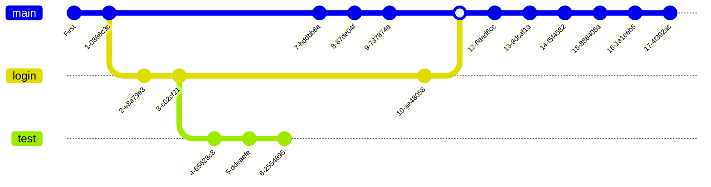

# Git course repository
This repo contains the classnotes for the [Git course](https://www.udemy.com/course/git-expert-4-hours/) offered by [Udemy](https://www.udemy.com) and Jad Khalili.

## Git
Is a version control software that allows you to track changes to files and keep track of your work or projects in a repository.

<div align="center">
    
    
</div>

The files are stored in a series of snapshots and branches. With git, you can prevent files against loss or damage, distribute files over time or work with complex project structures.

### Commands [^1]


```bash
git init --------------------------------------- Iniciar repositorio
```
git checkout <rama> ---------------------------- Cambiar de rama

git branch <rama> ------------------------------ Crear rama(-m renombrar)

git add <archivo> ------------------------------ Agregar archivo a stage area

git commit -m <mensaje> ------------------------ Agregar desde stage area a repositorio (--amend para corregir el commit anterior)

git status ------------------------------------- Ver el estado de los archivos

git log ---------------------------------------- Registro de los commits de la rama

git log --graph --all -------------------------- Registro grafico de todas las ramas

git remote add <nombre_rama_remota> <url> ------ Agregar repositorio remoto

git pull <nombre_rama_remota> <url> ------------ Sincronizar desde repositorio remoto (-allow-unrelated-histories cuando no tienen commits en común)

git push <nombre_rama_remota> <url> ------------ Subir a repositorio remoto

git merge <nombre_rama> ------------------------ Unir otra rama a la rama actual

git tag <nombre> ------------------------------- Etiiqueta para identificar algo, como versiones

git reflog ------------------------------------- Últimos cambios con ID

git reset --<tipo> <ID> ------------------------ Devuelve al punto ID(--hard borra los cambios sin commit, --soft mantiene los cambios sin comit)
	
git remote -v ---------------------------------- Listar repositorios remotos

git remote add <nombre> <url> ------------------ Agregar repositorio remoto


## Train register
The next graph shows the git log of this repository.



## Resources
[^1]: [Joshnh git commands summary](https://github.com/joshnh/Git-Commands)