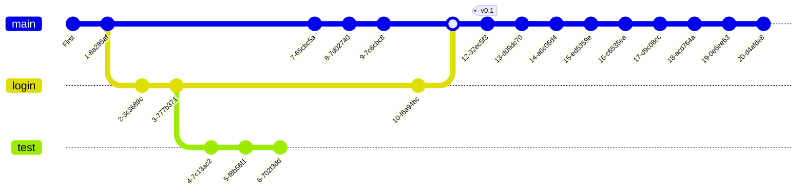

# Git course repository
This repo contains the classnotes for the [Git and GitHub course](https://www.platzi.com/cursos/git-github/) offered by [Platzi](https://www.platzi.com) and Freddy Vega.

## Git
Is a version control system created by Linus Torvals that allows you to track changes to files and keep track of your work or projects in a repository.

    
    

The files are stored in a series of snapshots and branches, in addition, who made it. With git, you can prevent files against loss or damage, distribute files over time or work with complex project structures.

### Commands [^1]

#### Create a repository

| Command | Description |
| :--------- | :------------- |
| `git init` | Initializes a local git repository. |
| `git clone <url>` | Clones a remote repository in a local machine with the *url*. |

#### Information about the repository

| Command | Description |
| :--------- | :------------- |
| `git status` | View the state of the staging area and the working directory. |
| `git log` | View the history of the repository. With the mnemonic **a dog**[^dog]. With the `-s` flag, you can search a word in the commit history. |
| `git show [<commit-id or file>]` | View the whole changes of a commit or a file. If argument is not specified, the changes in the last commit are shown. |  
| `git diff [<commit1> <commit2]` | Shows the difference between the *commit1* and the *commit2*. If commits are not specified, shows the difference between the current commit and the last commit. |  
| `git reflog` | Shows the history of the repository, even if the branches were deleted. |

#### Staging area
Staging area is a temporary memory area where you can add files to be committed.

| Command | Description |
| :--------- | :------------- |
| `git commit [-m "<message>"]` | Commit the changes in the staging area. If `-m` is not specified, the default text editor will open and you must enter the message there. In addition, with `--amend` you can amend the last commit. |

#### Commit changes

| Command | Description |
| :--------- | :------------- |
| `git add <file1> [<file2> ...]` | Adds files to the staging area. With the `-A` flag or `.` (current folder), all files are added. |
| `git rm <file1> <file2> ...` | *Removes files*. With `--cached` flag, the files are removed from the staging area and preserved in the working directory; and with `-f` flag, the files are removed from the *history* and the working directory. |
| `git reset <commit-id>` | Restore the files to the version of the *commit-id* preserving the changes in the staging area (`--soft` flat by default). With `--hard`, the files are restored to the version of the *commit-id* and the working directory. Using `git reset HEAD` clean the staging area. |
| `git checkout <commit-id> <file>` | Restore the file to the version of the *commit-id* but does not move the *HEAD* pointer neither cleans the history. |

#### Branching

| Command | Description |
| :--------- | :------------- |
| `git branch <branch-name>`| Creates a new branch. With `-d` flag, deletes the branch, `-a` list all branches (local and remote) and `-m` flag, rename the branch. |
| `git checkout <other-name>` | Switch to the *other-name* branch. With `-b` flag, create other branch. |
| `git merge <other-name>` | Merge the *other-name* branch into the current branch. When the merge is unsuccessful, the current branch is left in a conflicted state and the merge can be resolved by hand or aborted with `--abort` flag. |
| `git rebase <other-name>` | First rebase the *other-name* branch into the current branch and then rebase the current branch into the *other-name* branch. (Use only for local repositories) |

#### Tools

| Command | Description |
| :--------- | :------------- |
| `git stash` | Stash the changes while you are working on other files or branches. |
| `git stash list` | List the stashes. |
| `git stash pop` | Restore the stashed changes. |
| `git stash branch <branch-name>` | Create a new branch from the stashed changes. |
| `git stash drop` | Delete the stash files. |
| `git clean --dry-run` | Show the files that would be deleted. |
| `git clean -f` | Remove untracked files (folder will not be removed). |
| `git cherry-pick <commit-id>` | Cherry-pick the *commit-id* (of any branch) into the current branch. *This commands may generate conflicts when merging.* |
| `git grep <pattern>` | Search for *pattern* in the current branch files. With the `-c` flag, counts the number of occurrences. |
| `git blame <file>` | Show the history of the *file* and the author who made the changes by line. |

#### Tags

| Command | Description |
| :--------- | :------------- |
| `git tag -a <tag-name> -m "<message>" <commit-id>` | Creates a tag with the *tag-name* and *message* in the *commit-id*. |
| `git show-ref --tags` | List all tags. |
| `git tag -d <tag-name>` | Deletes the *tag-name* tag. Use `git push <alias> :refs/tags/<tag-name>` to delete the tag from the remote repository. |

#### Remote repositories

| Command | Description |
| :--------- | :------------- |
| `git remote add <alias> <url>` | Adds a remote repository with the *alias* and *url*. |
| `git remote -v` | List all remote repositories. |
| `git push <alias> <branch>` | Pushes the *branch* to the *alias* repository. |
| `git pull <alias> <branch>` | Pulls the *branch* from the *alias* repository. When the remote repository has different commits than the local repository, use the `--allow-unrelated-histories` flag . |
| `git remote set-url <alias> <url>` | Changes the *url* of the *alias* repository. |
| `git push <alias> --tags` | Pushes the tags to the *alias* repository. |
| `git push <alias> -d <branch-name>` | Delete the *branch-name* branch in the *alias* repository. |

#### Configuration

| Command | Description |
| :--------- | :------------- |
| `git config --list`| List all the configuration options. With the `--show-origin` flag, the path of the configuration file is shown. |
| `git config <key> <value>` | Set a configuration option. Use the `--global` flag to set a global configuration option. To use git aliases, use the `git config --global alias.<alias-name> "<command>"` command. |
| `ssh-keygen -t rsa -b 4096 -C "<email>"` | Generates a new SSH key in your local machine with *rsa* algorithm and *4096* bits. To test if the keys server is working (in Linux or Mac), you can use the `eval $(ssh-agent -s)` command and the `ssh-add <path-to-private-key>` command to add the key to the agent. With `git remote add <ssh-url>`, push and pull changes will not require a password. |

### Gitignore
To ignore files, you can use the `.gitignore` file. This file is a text file that contains the names of the files to be ignored or the paths of the folders to be ignored. The options are:

* `# comment`: comments
* `/path/to/folder`: ignore the folder and all its contents
* `*.extension`: ignore all files with the extension
* `!*.extension`: do not ignore files with the extension

## Train register
The next graph shows the git log of this repository.

## Resources
[^1]: [Joshnh git commands summary](https://github.com/joshnh/Git-Commands)

[^dog]: Add alias `git config --global alias.superlog "log --all --decorate --oneline --graph"` to use the `superlog` command.

<!-- log --graph --abbrev-commit --decorate --date=relative --format=format:'%C(bold blue)%h%C(reset) - %C(bold green)(%ar)%C(reset) %C(white)%s%C(reset) %C(dim white)- %an%C(reset)%C(bold yellow)%d%C(reset)' --all -->
