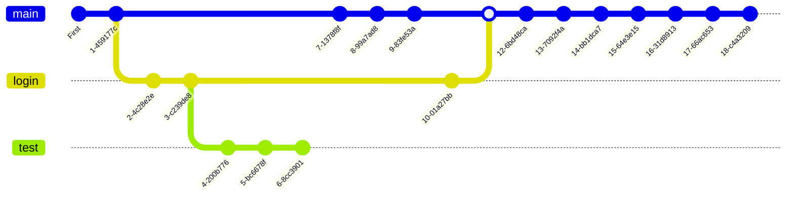

# Git course repository
This repo contains the classnotes for the [Git course](https://www.udemy.com/course/git-expert-4-hours/) offered by [Udemy](https://www.udemy.com) and Jad Khalili.

## Git
Is a version control system created by Linus Torvals that allows you to track changes to files and keep track of your work or projects in a repository.

    
    

The files are stored in a series of snapshots and branches, in addition, who made it. With git, you can prevent files against loss or damage, distribute files over time or work with complex project structures.

### Commands [^1]

#### Create a repository

| Command | Description |
| :--------- | :------------- |
| `git init` | Initializes a local git repository. |
| `git clone <url>` | Clones a remote repository in a local machine with the *url*. |

#### Information about the repository

| Command | Description |
| :--------- | :------------- |
| `git status` | View the state of the staging area and the working directory. |
| `git log` | View the history of the repository. With the mnemonic **a dog**, you can see the whole history (`--all`), the log with colors (`--decorate`),  in a single line (`--oneline`) and in a graph (`--graph`). |
| `git show [<commit-id or file>]` | View the whole changes of a commit or a file. If argument is not specified, the changes in the last commit are shown. |  
| `git diff [<commit1> <commit2]` | Shows the difference between the *commit1* and the *commit2*. If commits are not specified, shows the difference between the current commit and the last commit. |  

#### Staging area
Staging area is a temporary memory area where you can add files to be committed.

| Command | Description |
| :--------- | :------------- |
| `git commit [-m "<message>"]` | Commit the changes in the staging area. If `-m` is not specified, the default text editor will open and you must enter the message there. In addition, with `--amend` you can amend the last commit. |

#### Commit changes

| Command | Description |
| :--------- | :------------- |
| `git add <file1> [<file2> ...]` | Adds files to the staging area. With the `-A` flag or `.` (current folder), all files are added. |
| `git rm <file1> <file2> ...` | *Removes files*. With `--cached` flag, the files are removed from the staging area and preserved in the working directory; and with `-f` flag, the files are removed from the *history* and the working directory. |
| `git reset <commit-id>` | Restore the files to the version of the *commit-id* preserving the changes in the staging area (`--soft` flat by default). With `--hard`, the files are restored to the version of the *commit-id* and the working directory. Using `git reset HEAD` clean the staging area. |
| `git checkout <commit-id> <file>` | Restore the file to the version of the *commit-id* but does not move the *HEAD* pointer neither cleans the history. |

#### Branching

| Command | Description |
| :--------- | :------------- |
| `git branch <branch-name>`| Creates a new branch. With `-d` flag, deletes the branch, `-a` list all branches (local and remote) and `-m` flag, rename the branch. |
| `git checkout <other-name>` | Switch to the *other-name* branch. |
| `git merge <other-name>` | Merge the *other-name* branch into the current branch. When the merge is unsuccessful, the current branch is left in a conflicted state and the merge can be resolved by hand or aborted with `--abort` flag. |

#### Remote repositories

| Command | Description |
| :--------- | :------------- |
| `git config --list`| List all the configuration options. With the `--show-origin` flag, the path of the configuration file is shown. |

#### Configuration

| Command | Description |
| :--------- | :------------- |
| `git config --list`| List all the configuration options. With the `--show-origin` flag, the path of the configuration file is shown. |
| `git config <key> <value>` | Set a configuration option. Use the `--global` flag to set a global configuration option. |

git remote add <nombre_rama_remota> <url> ------ Agregar repositorio remoto

git pull <nombre_rama_remota> <url> ------------ Sincronizar desde repositorio remoto (-allow-unrelated-histories cuando no tienen commits en común)

git push <nombre_rama_remota> <url> ------------ Subir a repositorio remoto

git tag <nombre> ------------------------------- Etiiqueta para identificar algo, como versiones

git reflog ------------------------------------- Últimos cambios con ID

git remote -v ---------------------------------- Listar repositorios remotos

git remote add <nombre> <url> ------------------ Agregar repositorio remoto

## Train register
The next graph shows the git log of this repository.

## Resources
[^1]: [Joshnh git commands summary](https://github.com/joshnh/Git-Commands)